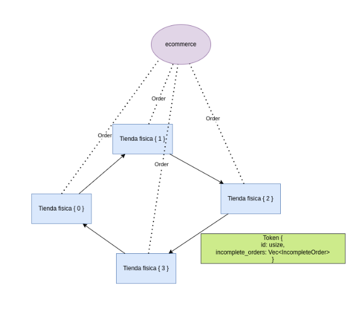
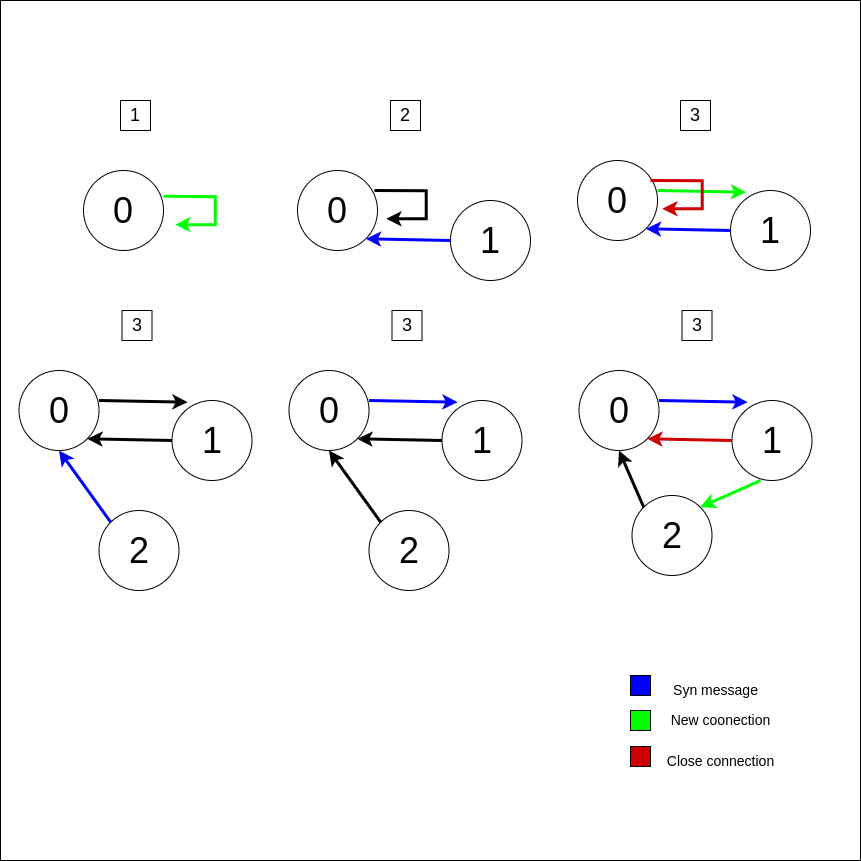
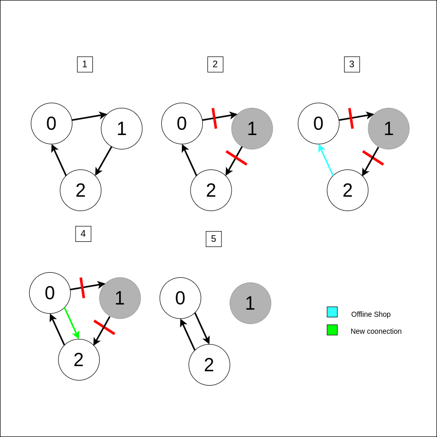

# TP - Manejo de Stocks

## Integrantes
| Nombre                                                        | Padrón |
| ------------------------------------------------------------- | ------ |
| [Scazzola, Martin]         					| 106403 |
| [Duca, Francisco]   						| 106308 |
| [Bonfil, Lucas]     						| 101076 |

### Dependencias

* `actix` y `actix-rt` para usar actores
*  `tokio` y `async_std` para comunicacion asincronica entre entidades.
* `serde` y `serde_json` para serializar mensajes.
* `colored` para imprimir por pantalla con estilos personalizados.
* `rand` para la generacion de numeros y booleanos aleatorios.

## Ejecucion
  Para correr las tiendas fisicas se van a necesitar correr el comando:

    cargo run <store_id> <total_stores>

  * Donde store_id es el id de la tienda, numero entre 0 y total stores - 1
  * Total store es la cantidad maxima de tiendas que se pueden conectar

  Para correr el ecommerce se debe ejecutar:
    
    cargo run <total_stores> <file_path>
  
  * Donde file_path es la ruta del archivo de ordenes

### Arquitectura de las tiendas fisicas
Las tiendas fisicas tienen 3 entidades:

* `Inventory`: un actor que se encarga de administrar el stock de los poroductos disponibles.
* `OrderDeliverer`: un actor que se encarga de simular las entregas de ecommerce y devolver los productos al Inventoy en caso de que estas entregas hAyan fracasado.
* `Shop`: Esta entidad maneja las conecciones TCP y la comunicacion con las tiendas de ecommerce y el resto de las tiendas fisicas. 

### Arquitectura de la comunicacion entre tiendas

Las tiendas fisicas se comunican entre si formando un token ring. cada tienda resuelve consultas a traves de tres medios distintos. 
* El primero son los pedidos de stock en la tienda fisica, cuando esto ocurre, el producto es entregado de inmediato y desaparece del stock, en caso de que no se pueda resolver la consulta, el pedido se desecha. 
* El segundo es por medio de tiendas ecommerce, estos pedidos al crearse reservan los productos para ser entregados con cierta probabilidad de que estos sean devueltos. En caso que no se puedan resolver estos pedidos, estos se pasan al token-ring asi otra tienda trate de resolver la consulta. 
* Finalmente, estan los pedidos de otras tiendas. Cuando un comercio recibe el token, trata de resolver todas las consultas que esta tenga dentro de forma similar a los pedidos de ecommerce.  

Cuando una tienda recibe el token estas hacen dos cosas, la primera es tratar de resolver todos los pedidos que esten en viaje dentro del token ring, si detecta un pedido que salio de si mismo lo descarta, ya que significa que el producto paso por todas las demas tiendas conectadas y no pudo realizar el pedido. 
Luego agrega a la lista todas los pedidos  que no pudieron ser resueltos y se agregan al token para que otras tiendas puedan resolverlas.

### Mensajes entre tiendas
`SYN_TYPE`: Este es el mensaje que crea una tienda fisica al conectarse o reconectarse si descubre que hay un tocken ring funcionando, al recibir este mensaje, una tienda fisica va a actualizar su nodo siguiente en caso que su actual siguiente tenga un ID superior a la nueva tienda que se acaba de conectar, o va a reenviar el mensaje al siguiente nodo.

`TOKEN_TYPE`: Este es el mensaje que se van pasando los distintos nodos de forma ciclica. En este hay un ID autoincremental que se actualiza cada vez que pase por una tienda fisica y una lista de pedidos de ecommerce que las tiendas fisicas no pudieron resolver previamente.

`OFFLINE_SHOP`: Este mensaje lo crea una tienda cuando se desconecta su anterior, contiene el ID de la tienda que se desconecto y el ID de la tienda que detecto la desconexion para poder rearmar el anillo de nuevo. 

### Arquitectura de ecommerce
Las tiendas de ecommerce son relativamente sencillas, su unica funcion es leer un archivo de pedidos y distribuir las entregas entre distintas tiendas fisicas. 
Estas se conectan a las tiendas fisicas mediante un puerto especifico y mandan peticiones a dicho puerto. 
Cuando se desconecta una tienda fisica, la tienda de ecommerce trata de reconectarse a dicha tienda, si falla, los pedidos que hubieran ido a dicha tienda son entregadas a otra y vuelve a tratar de conectarse a dicha tienda fisica en un futuro.
  
## Comunicacion entre servidores
Para que los servidores se comuniquen entre si utilizamos el algoritmo de Token Ring, como se ve en el diagrama de ejemplo:

### Inicio de conexion

* La tienda 0 busca conectarse a alguna de las tiendas siguientes y no encuentra ninguna por lo tanto se conecta con sigo misma
* La tienda 0 recibe un mensaje de la tienda 1 para sincronisarse al token ring.
* La tienda 1 recibe el mensaje del tienda 0 con informacion sobre la tienda a la que estaba enviando mensajes previamente (en este caso era la tienda 0). ahora la tienda 0 deja de enviarse el token a si mismo y pasa a enviarsela a la tienda 1. luego la tienda 1 pasa a enviarle el token a la tienda 0.
* La tienda 2 se comunica con la primera tienda siguiente que este conectada para entrar al token, en este caso la 0, pero en caso de que esta no este en funcionamiento, cualquier tienda tiene capacidad de atender nuevas tiendas entrando al ring.
* La tienda 0 pasa la informacion de la coneccion a traves del anillo para poder conectarse con el orden correcto, en este caso entre la tienda 1 y la 0.
* La tienda 1 deja de enviar mensajes a la tienda 0 (flecha roja) y pasa a enviarselos a la 2 (flecha verde), que ahora es quien le envia los mensajes a la tienda 0.

### Caida de una tienda

* Todos las tiendas (0, 1, y 2) están en funcionamiento y conectadas en un anillo.
* La tienda 1 falla o se desconecta de la red
* La tienda 2 detecta que la tienda 1 ha fallado y envía un mensaje de falla a la tienda 0.
* La tienda 0 establece una nueva conexión con quien era el siguiente a la tienda 1 (indicado por la flecha verde) en este caso la tienda 2. Esto mantiene la integridad del anillo, permitiendo que la comunicación continúe a pesar de la caída de la tienda 1.
* Con la nueva conexión establecida, la tienda 0 y la tienda 2 continúan la comunicación, omitiendo el nodo caído.

